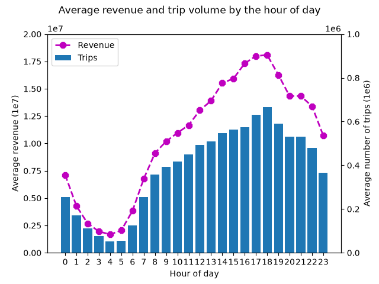
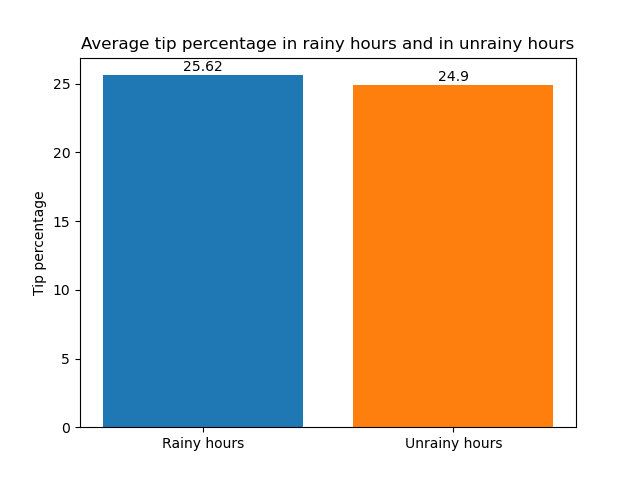
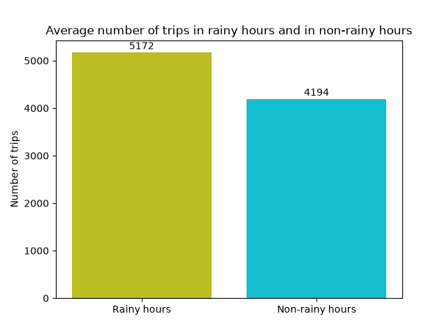
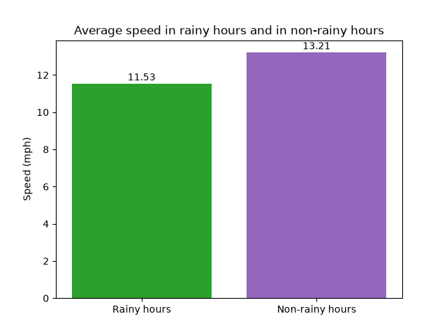
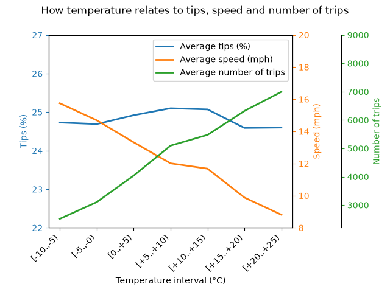

# Project Assignment: NYC Taxi × Weather Analytics with Apache Spark

## About

It is an analytics pipeline that answers a real question: **does weather affect taxi rides in New York?** Several months of real trip data was loaded, cleaned, aggregated,enriched with data from a public weather API and a reference table. Findings with numbers and charts was written and located right here as well as in code.

## Data sources

1. **NYC Yellow Taxi trip records** - official Parquet files. Direct link:
   `https://d37ci6vzurychx.cloudfront.net/trip-data/yellow_tripdata_2024-01.parquet` (and `-02`, `-03`).
   Landing page with docs and data dictionary: https://www.nyc.gov/site/tlc/about/tlc-trip-record-data.page
2. **Taxi Zone Lookup Table** Linked on the same landing page 
   (`https://d37ci6vzurychx.cloudfront.net/misc/taxi_zone_lookup.csv`).
3. **Open-Meteo historical weather API** - hourly precipitation and temperature for NYC:
   `https://archive-api.open-meteo.com/v1/archive?latitude=40.71&longitude=-74.01&start_date=2024-01-01&end_date=2024-03-31&hourly=temperature_2m,precipitation&timezone=America/New_York`

## Setup and run instructions

**Requirements:** Java 11 or 17 (`java -version`), Python 3, and:

```bash
pip install pyspark requests matplotlib
```

**No data is tracked in this repository** - `data/` is gitignored and rebuilt from the three public sources listed above.

**Note:** you should check every path to raw data carefully, several of them uses absolute path.

**Run** from the repository root, in this order. Spark runs in local mode (`local[*]`), no cluster needed.

```bash
python 00_download.py
```

It fetches the three monthly Parquet files (~155 MB), the zone lookup CSV and the Open-Meteo weather JSON into `data/`, checking each one after it lands. Re-running skips files that are already present and intact, so it is safe to repeat; `--force` re-downloads everything.

```bash
python 01_load_and_clean.py
```

It cleans the raw trips and writes `data/cleaned_trips/`, partitioned by `pickup_date`. Every other script reads that directory, so it must run first; scripts 02–05 are independent of each other and can run in any order.

| Script | What it does |
|---|---|
| `00_download.py` | Downloads the raw trips, zone lookup and weather JSON into `data/` |
| `01_load_and_clean.py` | Loads 3 months, applies cleaning rules, adds derived columns |
| `02_core_analytics.py` | Trips/revenue per day, hour, weekday; daily averages |
| `03_weather_enrichment.py` | Joins Open-Meteo hourly weather, rain and temperature analysis |
| `04_zone_enrichment.py` | Broadcast join with zone lookup, top zones, tips by borough |
| `05_window_functions.py` | Day-over-day change, 7-day rolling average, top-3 busiest hours |

Charts open in matplotlib windows (`plt.show()`)

## Cleaning rules

Applied in [01_load_and_clean.py](01_load_and_clean.py).

**Step 1 - drop incomplete rows.** Rows with a null in any of `tpep_pickup_datetime`, `tpep_dropoff_datetime`, `trip_distance`, `fare_amount`, `total_amount` are dropped. Without this, group-by comparisons stop being apples-to-apples, because different aggregates would be computed over different subsets of rows.

**Step 2 - drop implausible rows.** A row is rejected if it matches *any* of the rules below:

| Rule condition | Why |
|---|---|
| pickup < `2024-01-01` or ≥ `2024-04-01` | Only Q1 2024 is analysed; the raw data contains trips dated 2001 and 2098 |
| pickup ≥ dropoff | A trip cannot end before (or exactly when) it starts |
| duration > 6 h | Trips that long normally end outside NYC |
| distance ≤ 0 or ≥ 100 miles | Non-positive distance is broken data; 100+ miles is out of scope |
| `fare_amount` ≤ 0 | Broken values, and a zero-division guard for `tip_pct` |
| `total_amount` ≤ 0 | Broken values, and a zero-division guard |

In terminal you can see the output how many rows was dropped by specific rule. Rules are counted independently, so a single bad row can be dropped by several of them - the per-rule counts overlap and do not sum to the number of rows removed.

## Findings

### Trips volume and revenue by hour of the day

Revenue and the number of trips usually reach their maximum at 5 and 6 p.m. (rush hours after work) and the minimum at 4 and 5 a.m. (late night):




### Trips and revenue per day of week

Seems unobviously, but statistically Thursday is the busiest day of the week (in terms of revenue and number of trips). The "Thursday is a little Friday" rule applies.  

| Day of the week | Average number of trips | Average revenue per day of week |
|---|---|--|
| Thursday | 1490691 | $41,643,036 |
| Wednesday | 1380980| $38,168,216 |
| Friday | 1385242| $38,130,486 |
| Saturday | 1433735| $36,366,811 |
| Tuesday | 1254641| $34,614,781 |
| Sunday | 1167255| $32,553,191 |
| Monday | 1092751| $31,664,084 |

### During rainy hours

***rainy_hour_threshold = 2.5 mm/hour** The Bureau of Meteorology consider it as a lower bound for the moderate rain intensity - it is a lower bound for "rainy" hours in the project.

the tips percentage is 2.9 percent higher than when it's not raining:




the trip volume is 23.3 percent higher than when it's not raining:



the speed is 12.7 percent lower than when it's not raining:



### Temperature brackets

The number of trips goes up and the speed decreases significantly with increasing temperature, the tip percentage remains generally unchanged:



Difference between the data in the coldest interval and in the warmest one: 

    tips: 0.53% drop, speed: 44.06% drop, number of trips: 178.1% increase

## Questions

1. **Cash trips:** tips field wasn't populated for cash trips - ``tip_amount`` contains 0.0 everywhere for them.

2. **Difference between transformations and actions:** the data is loaded when Spark is triggered by action (`.show()`, in that case). For the actual computation **an action** is always needed, because transformation operations are lazy evaluated - the code computes only when the answer is needed, otherwise program delays the task:

```bash
   df = spark.read.parquet("data/cleaned_trips")

   daily = df.groupBy("pickup_date").agg(
      f.count("*").alias("trips_per_day"), 
      f.round(f.sum("total_amount")).alias("revenue_per_day")
   ).sort("pickup_date")
```

&emsp;&emsp;wait until action (lazy evaluation)

```bash
   daily.show()
```

&emsp;&emsp;action is here, can be executed.

3. For the **broadcast join** *no shuffle is required*. Spark takes the smaller table, broadcasts (copies) it to every executor in the cluster, then builds an in-memory hash table on each executor. The larger table stays partitioned, and each executor performs a local hash lookup to find matches. Make sense when one side is smaller than `spark.sql.autoBroadcastJoinThreshold` (default 10MB).

4. **Narrow and wide transformations:** shuffles usually happen with wide transformation and never with narrow transformation.

&emsp;&emsp;Narrow transformation:

```bash
   df.filter((f.col("speed_mph") < speed_threshold))
```

&emsp;&emsp;Wide transformation (need a shuffle):

```bash
   df.groupBy("pickup_date")
```

&emsp;&emsp;But "number of wide transformations" and "number of shuffles" are not always the same number. For example join usually has two input tables. It is one wide transformation, but it needs both sides shuffled.

5. **Cleaned output partitioned by date:** it was partitioned by `date` because that's the natural write key - adding new months becomes simpler and faster. It pays off in filtering queries where date is specified - Spark prunes the partitions and reads only the dates it needs. And in this specific case it is a good partition size - not so coarse for pruning and not so fine that the number of files becomes a problem.